# Andrew Mommers - GitHub Profile README

<div align="center">

<!-- Animated Header Banner -->


<!-- Typing Animation -->


<!-- Social Badges -->
<p>
  <a href="https://github.com/AndrewMommers">
    
  </a>
  <a href="https://linkedin.com/in/andrewmommers">
    
  </a>
  <a href="mailto:andrew.mommers@mommersco.com">
    
  </a>
  <a href="https://mommersco.com">
    
  </a>
</p>

</div>

---

## 🔮 **About Me**


**Visionary Entrepreneur** building the future through **Mommers Co** - where cutting-edge technology meets business innovation. With deep expertise in **cloud operations**, **managed services**, and **immersive gaming experiences**, I bridge the gap between complex technical solutions and real-world business needs.

🎯 **Currently Focused On:**
- Scaling **Mommers Co** operations and technology stack
- Advanced **MSP & Cloud Infrastructure** solutions
- **Arma 3 Realism** mod development and community building
- **Full-stack development** with modern frameworks

🌟 **Philosophy:** *"Innovation happens at the intersection of curiosity and execution"*

---

## ⚡ **Tech Arsenal**

<div align="center">

### **Languages & Frameworks**


### **Cloud & DevOps**


### **Databases & Tools**


### **Gaming & Specialized**


</div>

---

## 📊 **GitHub Analytics**

<div align="center">


</div>

<div align="center">

</div>

---

## 🌌 **3D Contribution Galaxy**

<div align="center">

<picture>
  <source media="(prefers-color-scheme: dark)" srcset="./profile-3d-contrib/profile-season-animate-dark.svg">
  <source media="(prefers-color-scheme: light)" srcset="./profile-3d-contrib/profile-season-animate-light.svg">
  
</picture>

</div>

---

## 🚀 **Featured Projects**

<div align="center">

<a href="https://github.com/Mommers-Co/Discord">
  
</a>

<a href="https://github.com/Mommers-Co/FS25-Dashboard">
  
</a>

<a href="https://github.com/GamingPanthers/A3-Realistic-Airborne">
  
</a>

<a href="https://github.com/GamingPanthers/TakLife">
  
</a>

</div>

---

## 💫 **Current Focus Areas**

```typescript
const andrewMommers = {
    company: "Mommers Co",
    role: "Founder & Technical Architect",
    currentProjects: [
        "Next-gen MSP platform development",
        "Advanced Arma 3 realism modifications",
        "Cloud infrastructure optimization",
        "AI-powered business solutions"
    ],
    technologies: {
        cloud: ["AWS", "Azure", "GCP"],
        languages: ["JavaScript", "TypeScript", "Python", "Go"],
        frameworks: ["Vue.js", "Nuxt.js", "Node.js"],
        gaming: ["SQF", "Arma 3 Modding", "Realism Systems"],
        databases: ["PostgreSQL", "MongoDB", "Redis"]
    },
    architecture: "Microservices + Event-Driven + Cloud-Native",
    motto: "Building tomorrow's solutions today ✨"
};
```

---

## 🎯 **Let's Connect & Collaborate**

<div align="center">

**Ready to build something amazing together?**

Whether you're interested in **cutting-edge cloud solutions**, **innovative business platforms**, or **immersive gaming experiences**, I'm always excited to connect with fellow innovators and creators.

📧 **Reach out:** [andrew.mommers@mommersco.com](mailto:andrew.mommers@mommersco.com)  
🌐 **Visit:** [mommersco.com](https://mommersco.com)  
💼 **Connect:** [LinkedIn](https://linkedin.com/in/andrewmommers)


</div>

---

<!-- Animated Footer -->


<div align="center">
<sub>⚡ Powered by passion, driven by innovation ⚡</sub>
</div>

---

## 📈 **Advanced Metrics Dashboard**

<div align="center">

<picture>
  <source media="(prefers-color-scheme: dark)" srcset="./metrics-dark.svg">
  <source media="(prefers-color-scheme: light)" srcset="./metrics-light.svg">
  
</picture>

</div>

---