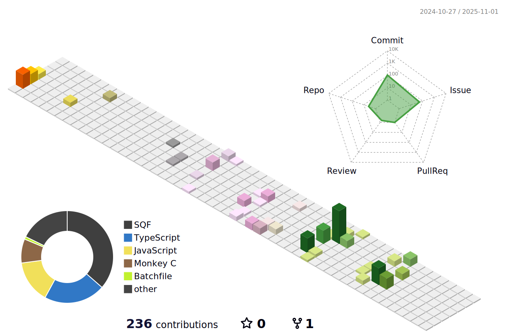

<!--
Brand palette — swap these HEX codes to your exact Mommers Co colors.
PRIMARY:   #00E5FF  (electric cyan)
ACCENT:    #7C3AED  (violet)
NEON:      #39FF14  (neon green)
SURFACE:   #0B1221  (deep navy)
TEXT:      #E6F2FF  (soft white)

Tip: search/replace the HEX values below to match your brand precisely.
-->

<!-- HERO / BANNER -->

  

<!-- SUBTITLE (animated) -->

  

<!-- QUICK LINKS / BADGES -->

  
  
  

---

### 🛰️ About
- Founder of **Mommers Co** (IT Services, Logistics, Waste Management)  
- Running **Mommers IT** — MSP, monitoring, and modern cloud hosting  
- Building with **NuxtJS**, **Node.js**, **PostgreSQL**, **Appwrite**  
- Side focus: **Arma 3** high-realism systems & tooling  
- Mission: **automation-first** ops with human-friendly UX

---

### ⚙️ Tech

  

---

### 📈 Highlights (Brand-themed)

  <!-- GitHub Stats -->
  
  

<!-- 3D CONTRIBUTIONS (generated by workflow) -->

  

<!-- METRICS (lowlighter/metrics – generated by workflow) -->

  

---

### 🧩 Current Focus
- **Management/Portal/Panel** mono-repo architecture (NuxtJS + Postgres)  
- **Status & Observability** across Website / Management / Portal / Discord / Servers  
- **Automation**: backups, audits, ticketing, alerts (Discord + Appwrite)

---

### 🎮 Arma 3 (WIP)
- **ADF AH-64D Apache Guardian** realism mod  
- Advanced medical system (ACE3 + KAT), damage modeling, and mission tooling

---

  

